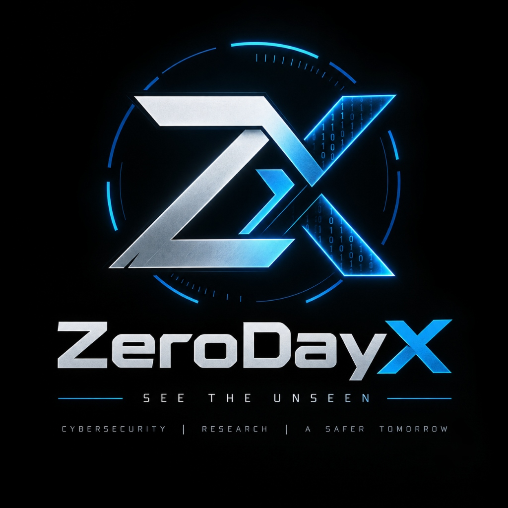

<div align="center">



# ZeroDayX — Autonomous AI Penetration Testing Platform

[](https://python.org)
[]()
[](https://hub.docker.com)
[]()
[]()

> **ZeroDayX is an autonomous AI penetration-testing system that gives an LLM the tools, environment, knowledge, and coordination mechanisms necessary to operate like a security-testing team.**

</div>

---

## Core Architecture

```text
                         USER
                           │
                           ▼
                    ┌─────────────┐
                    │ CLI / TUI   │
                    │ Cloud CLI   │
                    └──────┬──────┘
                           │
                           ▼
                  ┌──────────────────┐
                  │ Configuration    │
                  │ Targets          │
                  │ Scope            │
                  │ Budget           │
                  └────────┬─────────┘
                           │
                           ▼
                  ┌──────────────────┐
                  │ Threat Model     │
                  └────────┬─────────┘
                           │
                           ▼
                ┌───────────────────────┐
                │      ROOT AGENT       │
                │     LLM + reasoning   │
                └───────────┬───────────┘
                            │
              ┌─────────────┼─────────────┐
              │             │             │
              ▼             ▼             ▼
           Recon          Web/API       Source
           Agent          Agent         Agent
              │             │             │
              └─────────────┼─────────────┘
                            │
                            ▼
                     Coordination Bus
                            │
             ┌──────────────┼──────────────┐
             │              │              │
             ▼              ▼              ▼
           Notes          Todos         Coverage
             │              │              │
             └──────────────┼──────────────┘
                            │
                            ▼
                  ┌─────────────────┐
                  │ Security Tools  │
                  ├─────────────────┤
                  │ Browser         │
                  │ Terminal        │
                  │ Python          │
                  │ Caido           │
                  │ Nmap            │
                  │ Nuclei          │
                  │ SQLMap          │
                  │ Semgrep         │
                  │ Trivy           │
                  │ Gitleaks        │
                  └────────┬────────┘
                           │
                           ▼
                  ┌─────────────────┐
                  │ Docker Sandbox  │
                  │ Kali Linux      │
                  └────────┬────────┘
                           │
                           ▼
                         TARGET
                           │
                           ▼
                    Observed Results
                           │
                           ▼
                    Exploit Validation
                           │
                           ▼
                  ┌─────────────────┐
                  │ Deduplication   │
                  │ CVSS            │
                  │ Evidence        │
                  └────────┬────────┘
                           │
                           ▼
                     Vulnerability
                       Database
                           │
             ┌─────────────┼──────────────┐
             ▼             ▼              ▼
          Markdown        JSON          SARIF
             │             │              │
             └─────────────┼──────────────┘
                           ▼
                     Final Report
```

---

## ZeroDay's Core Philosophy

```text
LLM = Brain
Security Tools = Hands
Docker = Controlled Environment
Skills = Security Knowledge
Agent Graph = Security Team
Tracer = Memory
Evidence = Proof
Report = Final Output
```

The fundamental ZeroDay loop is:

```text
Understand Target
       ↓
Build Threat Model
       ↓
Plan Attack
       ↓
Spawn Specialists
       ↓
Recon
       ↓
Test
       ↓
Observe
       ↓
Reason
       ↓
Chain
       ↓
Exploit
       ↓
Validate
       ↓
Deduplicate
       ↓
Score
       ↓
Report
       ↓
Fix
       ↓
Retest
```

---

## ZeroDay Agent Architecture

The root agent acts as the orchestrator rather than performing every security test itself.

```text
                     ZERO DAY ROOT AGENT
                              │
            ┌─────────────────┼─────────────────┐
            │                 │                 │
            ▼                 ▼                 ▼
       Recon Agent       Web Agent         Source Agent
            │                 │                 │
            ▼                 ▼                 ▼
       Enumeration       Web Testing      Code Analysis
            │                 │                 │
            └─────────────────┼─────────────────┘
                              ▼
                       Shared Knowledge
                              │
                              ▼
                       New Findings
                              │
                              ▼
                    Additional Specialists
                              │
                              ▼
                       Validation Agent
                              │
                              ▼
                         Evidence
```

---

## ZeroDay's Main Modules

```text
zeroday/
│
├── interface/               # User experience & presentation layer
│   ├── CLI                  # Headless & scripted scanner CLI
│   ├── TUI                  # Interactive full-screen terminal UI
│   └── viewer/              # Web viewer frontend & local dashboard (port 8765)
│
├── agents/                  # Multi-agent graph & reasoning engine
│   ├── root_agent           # Strategic orchestrator & threat model planner
│   ├── specialized_agents   # Recon, Web/API, Source, & Validation specialists
│   ├── agent_lifecycle      # Agent state transitions, budgeting, & termination
│   └── coordination         # Shared context, task delegation, & message bus
│
├── tools/                   # Hands of the agent
│   ├── terminal             # Sandboxed shell command execution
│   ├── agent_browser        # Headless Playwright multi-tab browser automation
│   ├── proxy/               # Caido HTTP interception proxy & traffic inspection
│   ├── notes/               # Shared cross-agent intelligence repository
│   ├── todo/                # Dynamic testing backlog & objective tracker
│   ├── coverage/            # Attack surface exploration mapping
│   ├── threat_model/        # Structured asset & vulnerability hypothesis engine
│   └── mcp/                 # Model Context Protocol external tool servers
│
├── runtime/                 # Controlled execution environment
│   └── docker_sandbox       # Isolated Kali Linux container runtime
│
├── skills/                  # Security knowledge packs
│   ├── reconnaissance       # OSINT, subdomain, & port enumeration
│   ├── frameworks           # Django, FastAPI, NestJS, Next.js playbooks
│   ├── protocols            # OAuth, GraphQL, WebSocket analysis
│   ├── technologies         # Active Directory, Firebase, Supabase, LLM apps
│   ├── tooling              # Nmap, Nuclei, SQLMap, FFUF, Katana, Semgrep
│   └── vulnerabilities      # SQLi, SSRF, XSS, IDOR/BOLA, RCE, Deserialization
│
├── report/                  # Evidence, validation, & scoring
│   ├── findings             # Vulnerability models, CVSS 3.1 scoring, & triage
│   ├── evidence             # HTTP request/response traces & reproduction scripts
│   ├── deduplication        # Finding grouping & false-positive elimination
│   └── export               # Markdown, SARIF 2.1.0, JSON, & executive PDF reports
│
└── telemetry/               # Tracing & observability
    ├── logging              # Structured operational logging
    └── posthog              # Privacy-safe anonymous telemetry
```

---

## ZeroDay Sandbox

Every local attack payload and security scanner runs inside an isolated, disposable Kali Linux sandbox container:

```text
HOST MACHINE
 │
 │ Docker Sandbox Runtime
 ▼
┌────────────────────────────────────────────────────────┐
│                    ZERODAY SANDBOX                     │
│                                                        │
│  Base: Kali Linux Rolling                              │
│                                                        │
│  Network & Recon:                                      │
│  • nmap          • subfinder     • naabu     • httpx   │
│                                                        │
│  Web & API Testing:                                    │
│  • nuclei        • ffuf          • katana    • sqlmap  │
│  • Caido Proxy   • Playwright    • hurl      • zap     │
│                                                        │
│  Code Analysis & SAST:                                 │
│  • semgrep       • trivy         • gitleaks  • cvemap  │
│                                                        │
│  Execution & Scripting:                                │
│  • Python 3      • Bash / Zsh    • curl      • jq      │
└────────────────────────────────────────────────────────┘
```

---

## ZeroDay Security Testing Lifecycle

### 1. Target Discovery
```text
Target (URL / Repo / IP)
          ↓
   Target Manager
          ↓
  Scope Validation
          ↓
 Structured Threat Model
```

### 2. Reconnaissance
```text
Recon Specialist Agent
          ↓
Subdomains & DNS Enumeration
          ↓
Port Scanning & Service Fingerprinting
          ↓
API & Endpoint Crawling
          ↓
Technology Stack Detection
          ↓
Consolidated Attack Surface
```

### 3. Attack Surface Analysis
```text
Attack Surface
       ├── Web Application
       ├── REST & GraphQL APIs
       ├── Authentication & OAuth
       ├── Authorization & Access Control (IDOR/BOLA)
       ├── Cloud & Infrastructure Misconfigurations
       ├── Client-side JavaScript
       └── White-Box Source Code (SAST / Dependencies)
```

### 4. Vulnerability Hypothesis
```text
Observed Target Behavior
          ↓
Curated Security Skills & CVE Knowledge
          ↓
LLM Strategic Reasoning
          ↓
Prioritized Attack Hypotheses
```

### 5. Exploitation & Attack Simulation
```text
Potential Vulnerability
          ↓
Adaptive Payload Generation
          ↓
Sandboxed Tool Execution (Proxy / Terminal / Browser)
          ↓
Target HTTP / Service Response
          ↓
Behavioral Differential Analysis
```

### 6. Evidence-Based Validation
```text
Candidate Finding
          ↓
Deterministic Proof-of-Concept (PoC) Script
          ↓
Independent Reproduction Loop
          ↓
Strict Request/Response Evidence Capture
          ↓
Confirmed Actionable Vulnerability
```

### 7. Triage & Reporting
```text
Confirmed Findings
          ↓
Deduplication & Correlation
          ↓
Severity Calibration & CVSS 3.1 Scoring
          ↓
Actionable Remediation Guidance
          ↓
Multi-Format Export: Markdown, JSON, SARIF 2.1.0, & PDF
```

---

## ZeroDay's Major Advantage

Conventional scanners rely on brittle static pattern matching:

```text
Rule  ──►  Request  ──►  Regex Match  ──►  Finding (High False Positives)
```

ZeroDay operates like an experienced, adaptive security engineer:

```text
Observe
   ↓
Reason
   ↓
Hypothesize
   ↓
Select Tool
   ↓
Attack
   ↓
Observe Again
   ↓
Adapt Strategy
   ↓
Chain Vulnerabilities
   ↓
Validate with PoC
   ↓
Report with Proof
```

This transforms ZeroDay into an **agentic security platform** capable of finding complex multi-step vulnerabilities, business logic flaws, and access control breakdowns that traditional scanners miss.

---

## ZeroDay as an AI Security Operating System

```text
                        ┌───────────────────┐
                        │     ZERODAYX      │
                        └─────────┬─────────┘
                                  │
              ┌───────────────────┼───────────────────┐
              │                   │                   │
              ▼                   ▼                   ▼
          AI Agents         Security Tools        Knowledge
        (Reasoning)            (Hands)             (Skills)
              │                   │                   │
              └───────────────────┼───────────────────┘
                                  │
                                  ▼
                           Sandbox Runtime
                               (Docker)
                                  │
                                  ▼
                             Target Asset
                                  │
                                  ▼
                           Concrete Evidence
                               (Traces)
                                  │
                                  ▼
                          Validated Findings
                               (CVSS)
                                  │
                                  ▼
                             Final Report
```

> **Core Principle: ZeroDay combines AI reasoning, security tooling, multi-agent collaboration, sandboxed execution, security knowledge, evidence-based validation, and automated reporting into a single autonomous penetration-testing platform.**

---

## Quickstart

### 1. Prerequisites
- **Python 3.12+** (managed via [`uv`](https://docs.astral.sh/uv/))
- **Docker Desktop** (required for local autonomous scans)
- An LLM API key (OpenAI, Anthropic, OpenRouter, etc.)

### 2. Installation
Clone the repository and install all dependencies:

```bash
git clone https://github.com/DarkShadow-codex/ZeroDayX.git
cd ZeroDayX
uv sync
```

### 3. Run Autonomous Scans

```powershell
# Set your preferred LLM provider
$env:ZERODAY_LLM = "openrouter/z-ai/glm-5.3"
$env:LLM_API_KEY = "your-api-key"

# Quick scan of a web target (runs headless)
uv run zeroday -n -t https://example.com --scan-mode quick --max-budget 10

# Source code white-box audit
uv run zeroday -n -t ./ --scan-mode standard --max-budget 15
```

### 4. Interactive Web Results Viewer
Launch the local web viewer (native Windows/Linux/macOS, no Docker required):

```powershell
uv run zeroday view demo-scan --port 8765
```
Open the generated link in your browser to inspect vulnerabilities, request/response proof-of-concepts, CVSS breakdowns, and the real-time agent coordination topology.

---

## License

This project is licensed under the Apache License 2.0. See [LICENSE](LICENSE) for details.

